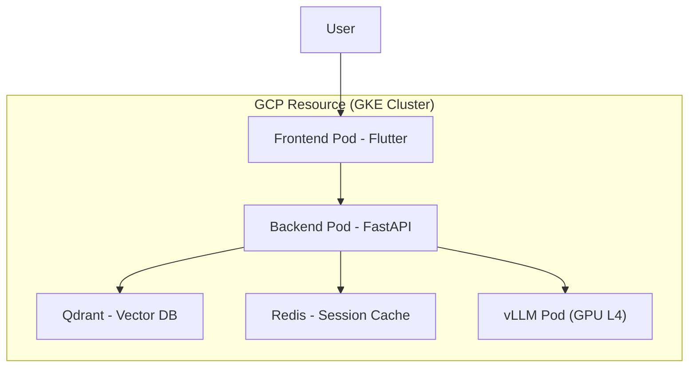
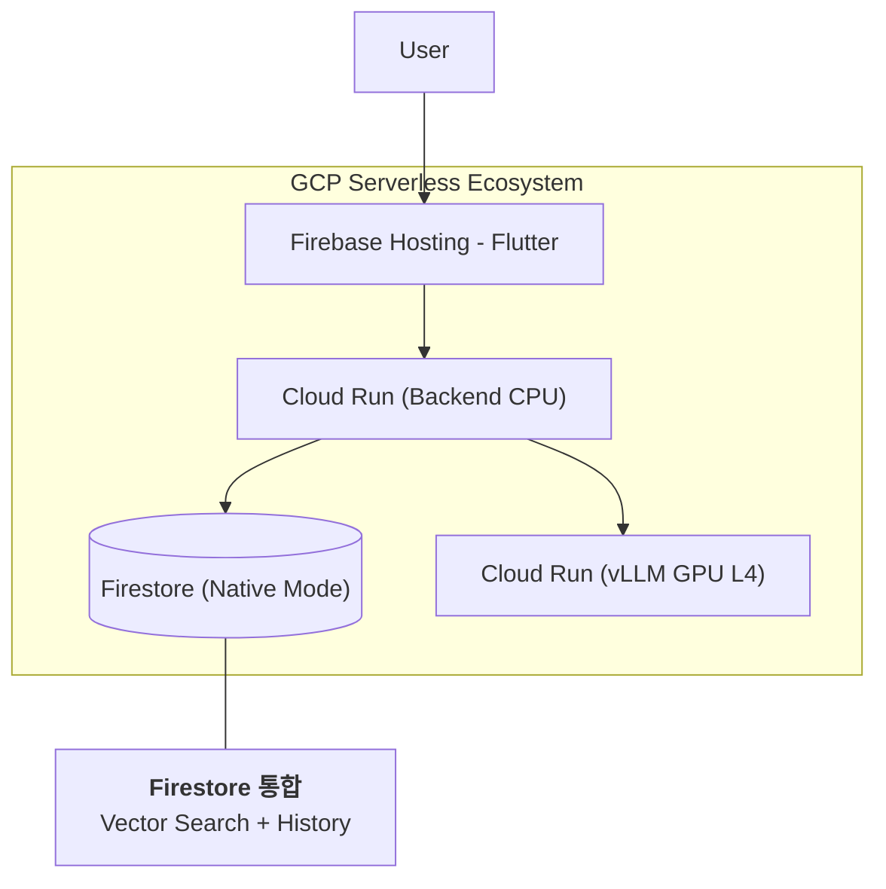
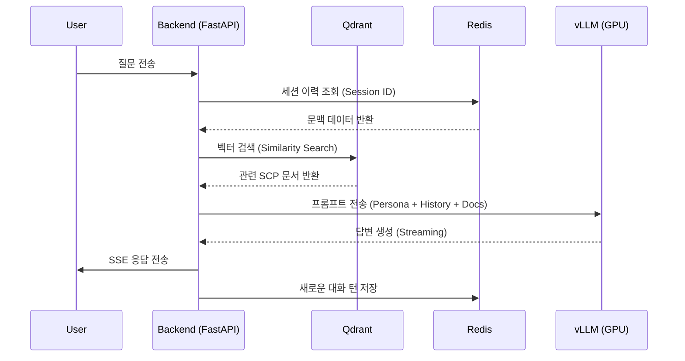
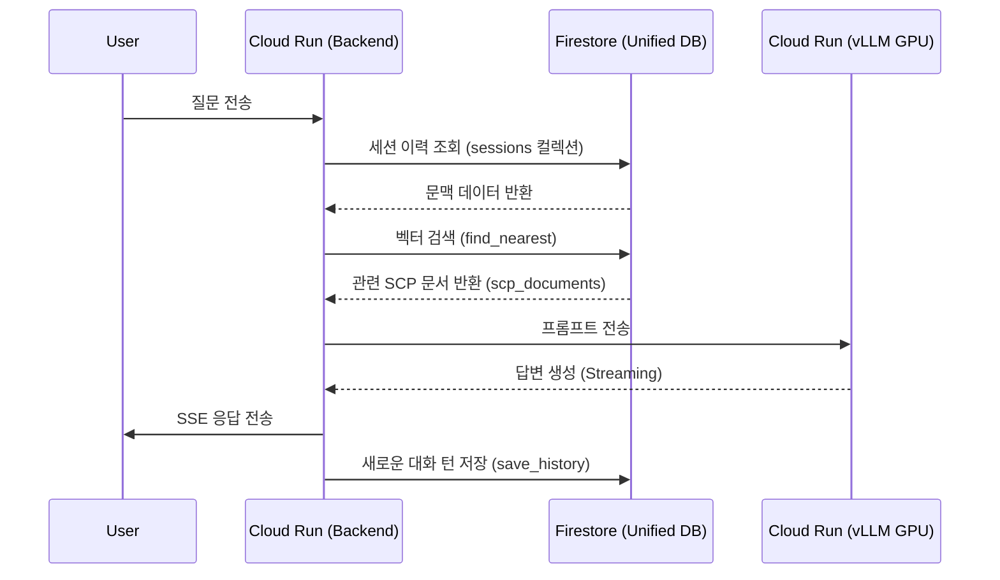

# SCP World 아키텍처 비교: GKE vs. Serverless

기존 GKE 기반의 복잡한 인프라에서 Cloud Run과 Firestore를 사용하는 비용 효율적인 서버리스 아키텍처로의 전환 과정을 정리했습니다.

---

## 1. 시스템 구성도 (System Architecture)

### [Before] GKE 기반 (고정비 발생형)
기존 아키텍처는 GKE 클러스터 내에서 모든 구성 요소를 파드(Pod) 형태로 관리했습니다. CPU와 메모리 점유로 인해 인스턴스가 24시간 가동되어야 하므로 고정 비용이 높았습니다.

### [After] Serverless 환경 (비용 최적화형)
수정 후 아키텍처는 관리형 서비스를 사용하여 유휴 상태일 때 비용이 발생하지 않거나(0원), 처리량에 비례하여 비용을 지불하는 구조입니다.

---

## 2. 데이터 흐름도 (Data Flow)

### [Before] 파편화된 데이터 관리
데이터가 검색(Qdrant), 세션(Redis), 영구 저장(DB)으로 파편화되어 있어 로직이 복잡했습니다.

### [After] Firestore 중심의 단일화된 흐름
Firestore가 벡터 검색과 세션 관리를 모두 수행하므로 데이터 흐름이 단순해지고 인프라 의존성이 줄어듭니다.

---

## 💡 주요 변경 포인트
1.  **단일 DB 전략**: Qdrant와 Redis를 **Firestore 하나로 통합**하여 관리 포인트를 획기적으로 줄였습니다.
2.  **GPU 서버리스화**: GKE 노드 풀 대신 **Cloud Run GPU**를 사용하여 사용한 시간(초 단위)만큼만 GPU 비용을 지불합니다.
3.  **정적 웹 호스팅**: 기존 Nginx 파드 대신 **Firebase Hosting**을 사용하여 글로벌 CDN을 통한 빠른 배포와 0원 수준의 유지비를 달성합니다.
