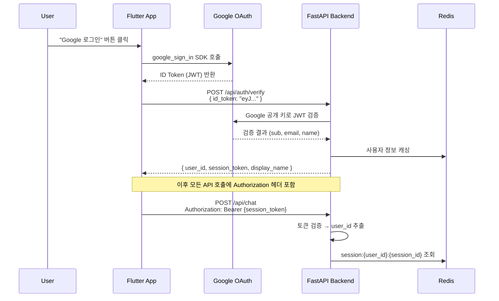
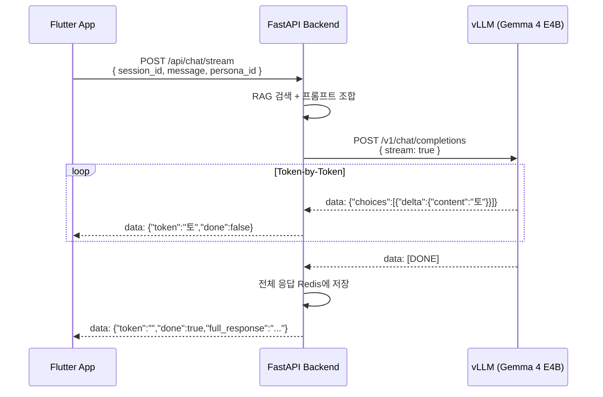
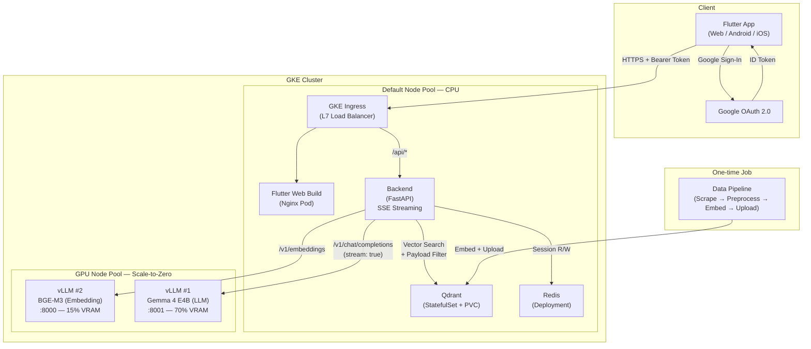

# SCP World — 작업 명세서 v3 (Work Specification)

> SCP 재단 위키 데이터(CC-BY-SA 3.0)를 학습한 장기 기억(Memory) 기반 페르소나 캐릭터 챗봇.
> GCP GKE 클라우드 네이티브 환경에서 구동되는 풀스택 AI 포트폴리오 프로젝트.

---

## 1. 프로젝트 개요

| 항목 | 내용 |
|------|------|
| **목표** | 'AI 캐릭터챗 LLM 개발자' 포지션 지원을 위한 풀스택 AI 포트폴리오 구축 |
| **핵심 기능** | SCP 재단 위키 데이터를 학습한 장기 기억 기반 멀티 페르소나 캐릭터 챗봇 |
| **인프라** | GCP GKE 환경, 실시간 GPU Scale-to-Zero 파이프라인 |
| **인증** | Google OAuth 2.0 로그인, JWT 기반 세션 격리 |
| **응답 방식** | SSE(Server-Sent Events) 스트리밍으로 실시간 토큰 전송 |
| **라이선스** | CC-BY-SA 3.0 (출처: SCP Foundation) |

---

## 2. 기술 스택

| 레이어 | 기술 | 비고 |
|--------|------|------|
| **Cloud Infra** | GCP (GKE, GCS, Artifact Registry), Docker, Kubernetes (Kustomize) | |
| **Frontend** | **Flutter** (Web/Android/iOS 크로스플랫폼) | Riverpod, GoRouter, google_sign_in |
| **Backend** | Python, **FastAPI** (비동기 I/O) | Uvicorn, Pydantic, SSE StreamingResponse |
| **Auth** | **Google OAuth 2.0** | Flutter → ID Token → Backend JWT 검증 |
| **AI Model** | **Gemma 4 E4B** (16-bit) | vLLM 인스턴스 #1 (port 8001) |
| **Embedding** | **BAAI/bge-m3** (568M, 다국어) | vLLM 인스턴스 #2 (port 8000), 같은 GPU |
| **ML Serving** | **vLLM** × 2 인스턴스 | 단일 GPU에서 포트 분리 |
| **Vector DB** | **Qdrant** (K8s StatefulSet) | Payload Filtering + Vector Similarity |
| **Session Store** | **Redis** (K8s Deployment) | 사용자별 대화 기록, TTL 만료 |

---

## 3. GPU VRAM 분배 전략 (L4 24GB 단일 GPU)

> [!IMPORTANT]
> 단일 L4 GPU(24GB)에서 vLLM 2개 인스턴스가 포트를 분리하여 VRAM을 공유합니다.

```
┌─────────────────────────────────────────────────┐
│               NVIDIA L4 GPU (24GB)              │
├──────────────────────┬──────────────────────────┤
│  vLLM Instance #1    │  vLLM Instance #2        │
│  Gemma 4 E4B (LLM)   │  BAAI/bge-m3 (Embedding) │
│  --gpu-memory-util   │  --gpu-memory-util       │
│  0.70                │  0.15                    │
│  --port 8001         │  --port 8000             │
│  ≈ 16.8GB            │  ≈ 3.6GB                 │
├──────────────────────┴──────────────────────────┤
│  System / CUDA Overhead: ≈ 3.6GB (15%)          │
└─────────────────────────────────────────────────┘
```

| 구분 | VRAM | 포트 | API |
|------|------|------|-----|
| Gemma 4 E4B (생성) | ≈ 16.8GB (70%) | 8001 | `/v1/chat/completions` |
| BGE-M3 (임베딩) | ≈ 3.6GB (15%) | 8000 | `/v1/embeddings` |
| System/CUDA | ≈ 3.6GB (15%) | — | — |

**구현 방식**: 단일 컨테이너 + 커스텀 `entrypoint.sh`에서 두 프로세스 실행

```bash
#!/bin/bash
set -e

# Instance #2: Embedding (백그라운드)
vllm serve BAAI/bge-m3 \
  --port 8000 \
  --gpu-memory-utilization 0.15 \
  --dtype float16 &

# Instance #1: LLM (포그라운드)
exec vllm serve google/gemma-4-E4B-it \
  --port 8001 \
  --gpu-memory-utilization 0.70 \
  --max-model-len 16384 \
  --dtype bfloat16 \
  --limit-mm-per-prompt image=0 audio=0
```

---

## 4. 인증 아키텍처 (Google OAuth 2.0)



| 항목 | 구현 |
|------|------|
| Flutter | `google_sign_in` 패키지 → ID Token 획득 |
| Backend | `google-auth` 라이브러리로 ID Token 검증 |
| 세션 키 | `session:{user_id}:{session_id}` — 사용자별 세션 격리 |
| 미들웨어 | FastAPI Dependency로 모든 `/api/*` 요청에 토큰 검증 |
| Secret | Google OAuth Client ID는 공개값 (ConfigMap), Client Secret은 K8s Secret |

---

## 5. SSE 스트리밍 응답 아키텍처



| 항목 | 구현 |
|------|------|
| Backend | `StreamingResponse(media_type="text/event-stream")` |
| vLLM | `stream=True` 옵션으로 토큰 단위 생성 |
| Flutter | `http` 패키지의 `Client.send()` + `StreamedResponse` |
| 저장 | 스트리밍 완료 후 전체 응답을 Redis 대화기록에 추가 |
| Fallback | `/api/chat` (non-streaming) 엔드포인트도 유지 |

---

## 6. 시스템 아키텍처



---

## 7. 프로젝트 디렉토리 구조

```
e:\WorkSpace\Antigravity\SCPWorld\
├── README.md                          # 프로젝트 소개, CC-BY-SA 3.0 표기
│
├── backend/                           # FastAPI 백엔드
│   ├── pyproject.toml                 # uv 의존성
│   ├── Dockerfile
│   ├── app/
│   │   ├── __init__.py
│   │   ├── main.py                    # FastAPI 앱, CORS, 라우터 등록
│   │   ├── config.py                  # Pydantic Settings
│   │   ├── dependencies.py            # 공통 의존성 (DB 클라이언트 등)
│   │   ├── models/
│   │   │   ├── __init__.py
│   │   │   ├── schemas.py             # ChatRequest, ChatResponse, SSE Event
│   │   │   └── session.py             # Message, ConversationHistory
│   │   ├── services/
│   │   │   ├── __init__.py
│   │   │   ├── rag_service.py         # Qdrant 하이브리드 검색
│   │   │   ├── embedding_service.py   # vLLM /v1/embeddings 호출
│   │   │   ├── llm_service.py         # vLLM /v1/chat/completions (SSE)
│   │   │   ├── memory_service.py      # Redis 세션/대화기록
│   │   │   └── prompt_service.py      # RAG + History → 프롬프트
│   │   ├── routers/
│   │   │   ├── __init__.py
│   │   │   ├── chat.py                # POST /api/chat, /api/chat/stream
│   │   │   ├── auth.py                # POST /api/auth/verify (Google OAuth)
│   │   │   ├── personas.py            # GET /api/personas
│   │   │   └── health.py              # GET /health, /ready
│   │   ├── middleware/
│   │   │   ├── __init__.py
│   │   │   └── auth.py                # JWT 검증 미들웨어 (Dependency)
│   │   └── core/
│   │       ├── __init__.py
│   │       └── personas.py            # 페르소나 정의 (톤앤매너만)
│   └── tests/
│       ├── test_rag_service.py
│       ├── test_memory_service.py
│       ├── test_prompt_service.py
│       └── test_auth.py
│
├── data-pipeline/                     # SCP 데이터 전처리
│   ├── pyproject.toml
│   ├── Dockerfile                     # sentence-transformers 포함 (일회성 Job)
│   ├── scripts/
│   │   ├── scrape_scp.py              # SCP 위키 스크래핑 (상위 200개)
│   │   ├── preprocess.py              # 텍스트 정제, 청크 분할, 메타데이터 분리
│   │   ├── embed_and_upload.py        # BGE-M3 임베딩 → Qdrant 업로드
│   │   └── validate_collection.py     # Qdrant 컬렉션 검증
│   ├── config/
│   │   └── scp_target_list.json       # 수집 대상 SCP 문서 목록 (확장 가능)
│   └── data/
│       └── .gitkeep
│
├── frontend/                          # Flutter 크로스플랫폼 앱
│   ├── pubspec.yaml
│   ├── Dockerfile                     # Multi-stage: Flutter build web → Nginx
│   ├── nginx.conf
│   ├── lib/
│   │   ├── main.dart
│   │   ├── app.dart                   # MaterialApp, GoRouter, 테마
│   │   ├── config/
│   │   │   ├── theme.dart             # SCP 다크 테마
│   │   │   └── constants.dart         # API URL, OAuth Client ID
│   │   ├── models/
│   │   │   ├── message.dart
│   │   │   ├── persona.dart
│   │   │   ├── user.dart              # 로그인 사용자 정보
│   │   │   └── chat_session.dart
│   │   ├── providers/
│   │   │   ├── auth_provider.dart     # Google Sign-In 상태
│   │   │   ├── chat_provider.dart     # 채팅 + SSE 스트리밍 상태
│   │   │   ├── persona_provider.dart  # 페르소나 선택
│   │   │   └── connection_provider.dart # vLLM health 상태
│   │   ├── services/
│   │   │   ├── api_service.dart       # HTTP REST (dio)
│   │   │   ├── sse_service.dart       # SSE 스트리밍 수신
│   │   │   └── auth_service.dart      # Google Sign-In + 토큰 관리
│   │   ├── screens/
│   │   │   ├── login_screen.dart      # Google 로그인 화면
│   │   │   ├── chat_screen.dart       # 메인 채팅 (SSE 스트리밍)
│   │   │   ├── persona_select_screen.dart
│   │   │   └── splash_screen.dart     # 로딩/웜업 상태
│   │   └── widgets/
│   │       ├── message_bubble.dart    # 채팅 버블 (스트리밍 텍스트 애니메이션)
│   │       ├── scp_text.dart          # [REDACTED] 스타일
│   │       ├── typing_indicator.dart
│   │       ├── persona_card.dart
│   │       └── footer.dart            # CC-BY-SA 3.0 라이선스
│   ├── web/
│   │   └── index.html
│   ├── android/
│   └── ios/
│
├── k8s/                               # Kubernetes 매니페스트
│   ├── namespace.yaml
│   ├── backend/
│   │   ├── deployment.yaml
│   │   ├── service.yaml
│   │   ├── hpa.yaml
│   │   └── configmap.yaml             # OAuth Client ID 등 비밀 아닌 설정
│   ├── vllm/
│   │   ├── deployment.yaml            # 듀얼 vLLM (커스텀 entrypoint)
│   │   ├── service-llm.yaml           # ClusterIP :8001
│   │   ├── service-embedding.yaml     # ClusterIP :8000
│   │   └── pdb.yaml
│   ├── qdrant/
│   │   ├── statefulset.yaml
│   │   ├── service.yaml
│   │   └── pvc.yaml
│   ├── redis/
│   │   ├── deployment.yaml
│   │   └── service.yaml
│   ├── frontend/
│   │   ├── deployment.yaml
│   │   └── service.yaml
│   ├── secrets/
│   │   ├── qdrant-secret.yaml         # 템플릿
│   │   ├── hf-secret.yaml             # HuggingFace Token
│   │   ├── redis-secret.yaml
│   │   └── oauth-secret.yaml          # Google OAuth Client Secret
│   ├── jobs/
│   │   └── data-pipeline-job.yaml
│   ├── ingress.yaml
│   └── kustomization.yaml
│
├── infra/                             # GCP 인프라 스크립트
│   ├── setup-cluster.sh
│   ├── setup-gpu-nodepool.sh          # min-nodes=0
│   ├── setup-artifact-registry.sh
│   ├── setup-oauth.sh                 # Google OAuth 설정 가이드
│   ├── warmup.sh                      # 수동 워밍업 (데모용)
│   └── teardown.sh
│
├── docker-compose.yaml                # 로컬 개발 (Qdrant + Redis + Backend)
├── .env.example
├── .gitignore
└── .dockerignore
```

---

## 8. 컴포넌트별 상세 설계

### 8.1 데이터 파이프라인 (`data-pipeline/`)

#### 8.1.1 SCP 위키 스크래핑 (`scrape_scp.py`)

- **대상**: `config/scp_target_list.json`에 정의된 상위 200개 문서
- **방법**: `requests` + `BeautifulSoup4`, Rate limiting (1req/2sec)
- **확장성**: `scp_target_list.json`만 수정하여 범위 확장 (코드 변경 없음)
- **출력 포맷** (JSON):
```json
{
  "item_number": "SCP-173",
  "object_class": "Euclid",
  "sections": {
    "containment_procedures": "...",
    "description": "...",
    "addendum": "..."
  },
  "raw_text": "...",
  "url": "https://scp-wiki.wikidot.com/scp-173",
  "tags": ["euclid", "sculpture", "autonomous"],
  "title": "The Sculpture - The Original"
}
```

#### 8.1.2 텍스트 전처리 (`preprocess.py`)

- Wikidot 마크업 제거
- 섹션별 청크 분할 (512토큰, 64토큰 오버랩)
- 메타데이터(item_number, object_class, section_type, tags)와 텍스트 분리

#### 8.1.3 임베딩 및 업로드 (`embed_and_upload.py`)

- **모델**: `BAAI/bge-m3` via `sentence-transformers` (일회성 Job이므로 직접 로드)
- **실행**: K8s Job (GPU 노드, vLLM 미가동 상태에서 전체 GPU 사용)
- **Qdrant Collection**:
```python
client.create_collection(
    collection_name="scp_documents",
    vectors_config=models.VectorParams(
        size=1024,  # BGE-M3 dense vector
        distance=models.Distance.COSINE
    )
)
# Payload Index
client.create_payload_index("scp_documents", "item_number",
                            models.PayloadSchemaType.KEYWORD)
client.create_payload_index("scp_documents", "object_class",
                            models.PayloadSchemaType.KEYWORD)
```
- **Point 구조**:
```python
models.PointStruct(
    id=uuid4().hex,
    vector=embedding.tolist(),
    payload={
        "item_number": "SCP-173",
        "object_class": "Euclid",
        "section_type": "description",
        "tags": ["euclid", "sculpture"],
        "text": "The chunk text content...",
        "url": "https://scp-wiki.wikidot.com/scp-173"
    }
)
```

---

### 8.2 FastAPI 백엔드 (`backend/`)

#### 8.2.1 설정 관리 (`config.py`)

```python
from pydantic_settings import BaseSettings

class Settings(BaseSettings):
    # Qdrant
    QDRANT_HOST: str = "qdrant.scp-world.svc.cluster.local"
    QDRANT_PORT: int = 6333
    QDRANT_API_KEY: str          # K8s Secret
    QDRANT_COLLECTION: str = "scp_documents"

    # vLLM — LLM (Gemma 4 E4B)
    VLLM_LLM_URL: str = "http://vllm-llm.scp-world.svc.cluster.local:8001/v1"
    VLLM_LLM_MODEL: str = "google/gemma-4-E4B-it"

    # vLLM — Embedding (BGE-M3)
    VLLM_EMBED_URL: str = "http://vllm-embedding.scp-world.svc.cluster.local:8000/v1"
    VLLM_EMBED_MODEL: str = "BAAI/bge-m3"

    # Redis
    REDIS_HOST: str = "redis.scp-world.svc.cluster.local"
    REDIS_PORT: int = 6379
    REDIS_PASSWORD: str = ""     # K8s Secret

    # Session
    MAX_CONVERSATION_TURNS: int = 10
    SESSION_TTL_SECONDS: int = 3600

    # OAuth
    GOOGLE_CLIENT_ID: str        # ConfigMap (공개값)
    GOOGLE_CLIENT_SECRET: str = ""  # K8s Secret (웹 앱용)

    class Config:
        env_file = ".env"
```

#### 8.2.2 인증 미들웨어 (`middleware/auth.py`)

```python
from google.oauth2 import id_token
from google.auth.transport import requests as google_requests
from fastapi import Depends, HTTPException, Header

async def verify_google_token(authorization: str = Header(...)) -> AuthUser:
    """
    모든 /api/* 요청에 적용되는 인증 Dependency.
    Authorization: Bearer <id_token_or_session_token>
    """
    token = authorization.removeprefix("Bearer ")
    try:
        # Google ID Token 검증
        idinfo = id_token.verify_oauth2_token(
            token,
            google_requests.Request(),
            settings.GOOGLE_CLIENT_ID
        )
        return AuthUser(
            user_id=idinfo["sub"],
            email=idinfo["email"],
            name=idinfo.get("name", "")
        )
    except ValueError:
        raise HTTPException(status_code=401, detail="Invalid token")
```

#### 8.2.3 인증 라우터 (`routers/auth.py`)

```python
@router.post("/api/auth/verify")
async def verify_login(request: AuthRequest):
    """
    Flutter에서 Google Sign-In 후 ID Token을 전달받아 검증.
    검증 성공 시 사용자 정보 반환.
    """
    idinfo = id_token.verify_oauth2_token(
        request.id_token,
        google_requests.Request(),
        settings.GOOGLE_CLIENT_ID
    )
    user = AuthUser(
        user_id=idinfo["sub"],
        email=idinfo["email"],
        name=idinfo.get("name", ""),
        picture=idinfo.get("picture", "")
    )
    # Redis에 사용자 정보 캐싱
    await redis.set(f"user:{user.user_id}", user.model_dump_json(), ex=86400)
    return {"user": user, "status": "verified"}
```

#### 8.2.4 임베딩 서비스 (`embedding_service.py`) — vLLM API 호출

```python
class EmbeddingService:
    """vLLM의 OpenAI-compatible /v1/embeddings API를 호출"""

    def __init__(self, base_url: str, model: str):
        self.client = httpx.AsyncClient(base_url=base_url, timeout=30.0)
        self.model = model

    async def encode(self, text: str) -> list[float]:
        response = await self.client.post("/embeddings", json={
            "model": self.model,
            "input": text
        })
        response.raise_for_status()
        return response.json()["data"][0]["embedding"]

    async def encode_batch(self, texts: list[str]) -> list[list[float]]:
        response = await self.client.post("/embeddings", json={
            "model": self.model,
            "input": texts
        })
        response.raise_for_status()
        return [d["embedding"] for d in response.json()["data"]]
```

#### 8.2.5 RAG 서비스 (`rag_service.py`) — 하이브리드 검색

```python
async def hybrid_search(
    query: str,
    item_number: str | None = None,
    object_class: str | None = None,
    top_k: int = 5
) -> list[SearchResult]:
    """Vector Similarity + Qdrant Payload Filtering 결합"""

    # 1. SCP 번호 자동 감지 (regex: SCP-\d{3,4})
    detected_scp = extract_scp_number(query)
    if detected_scp and not item_number:
        item_number = detected_scp

    # 2. vLLM Embedding API로 쿼리 벡터화
    query_vector = await embedding_service.encode(query)

    # 3. Payload Filter 구성
    conditions = []
    if item_number:
        conditions.append(models.FieldCondition(
            key="item_number",
            match=models.MatchValue(value=item_number)
        ))
    if object_class:
        conditions.append(models.FieldCondition(
            key="object_class",
            match=models.MatchValue(value=object_class)
        ))
    qdrant_filter = models.Filter(must=conditions) if conditions else None

    # 4. Qdrant 검색
    results = client.query_points(
        collection_name=settings.QDRANT_COLLECTION,
        query=query_vector,
        query_filter=qdrant_filter,
        limit=top_k,
        with_payload=True
    )
    return results
```

#### 8.2.6 LLM 서비스 (`llm_service.py`) — SSE 스트리밍

```python
class LLMService:
    def __init__(self, base_url: str, model: str):
        self.client = httpx.AsyncClient(base_url=base_url, timeout=120.0)
        self.model = model

    async def generate_stream(
        self, messages: list[dict]
    ) -> AsyncGenerator[str, None]:
        """vLLM에 스트리밍 요청, 토큰 단위로 yield"""
        async with self.client.stream(
            "POST", "/chat/completions",
            json={
                "model": self.model,
                "messages": messages,
                "stream": True,
                "max_tokens": 2048,
                "temperature": 0.7
            }
        ) as response:
            async for line in response.aiter_lines():
                if line.startswith("data: "):
                    data = line[6:]
                    if data == "[DONE]":
                        break
                    chunk = json.loads(data)
                    delta = chunk["choices"][0].get("delta", {})
                    if "content" in delta:
                        yield delta["content"]

    async def generate(self, messages: list[dict]) -> str:
        """Non-streaming 생성 (fallback)"""
        response = await self.client.post("/chat/completions", json={
            "model": self.model,
            "messages": messages,
            "max_tokens": 2048,
            "temperature": 0.7
        })
        response.raise_for_status()
        return response.json()["choices"][0]["message"]["content"]
```

#### 8.2.7 메모리 서비스 (`memory_service.py`) — Redis + 사용자 격리

```python
class MemoryService:
    def __init__(self, redis_client: redis.Redis, max_turns: int, ttl: int):
        self.redis = redis_client
        self.max_turns = max_turns
        self.ttl = ttl

    def _key(self, user_id: str, session_id: str) -> str:
        """사용자별 세션 격리: session:{user_id}:{session_id}"""
        return f"session:{user_id}:{session_id}"

    async def get_history(self, user_id: str, session_id: str) -> list[Message]:
        raw = await self.redis.get(self._key(user_id, session_id))
        if not raw:
            return []
        messages = json.loads(raw)
        return [Message(**m) for m in messages[-self.max_turns * 2:]]

    async def add_turn(
        self, user_id: str, session_id: str,
        user_msg: str, assistant_msg: str
    ):
        history = await self.get_history(user_id, session_id)
        history.append(Message(role="user", content=user_msg))
        history.append(Message(role="assistant", content=assistant_msg))
        trimmed = history[-self.max_turns * 2:]
        await self.redis.set(
            self._key(user_id, session_id),
            json.dumps([m.model_dump() for m in trimmed]),
            ex=self.ttl
        )
```

#### 8.2.8 프롬프트 서비스 (`prompt_service.py`)

> [!CAUTION]
> **금지사항 #7 준수**: 시스템 프롬프트는 톤앤매너만. 지식은 100% RAG에서 공급.

```python
def build_prompt(
    persona: Persona,
    rag_results: list[SearchResult],
    conversation_history: list[Message],
    user_message: str
) -> list[dict]:
    messages = []

    # 1. 시스템 프롬프트 — 톤앤매너만 (200자 이내)
    messages.append({"role": "system", "content": persona.system_prompt})

    # 2. RAG 컨텍스트
    if rag_results:
        context = "\n\n---\n\n".join([
            f"[{r.payload['item_number']}] ({r.payload['section_type']})\n"
            f"{r.payload['text']}"
            for r in rag_results
        ])
        messages.append({
            "role": "system",
            "content": f"# Retrieved SCP Documents:\n{context}"
        })

    # 3. 대화 기록 (최근 N턴)
    for msg in conversation_history:
        messages.append({"role": msg.role, "content": msg.content})

    # 4. 사용자 메시지
    messages.append({"role": "user", "content": user_message})
    return messages
```

#### 8.2.9 채팅 라우터 (`routers/chat.py`) — SSE 스트리밍

```python
@router.post("/api/chat/stream")
async def chat_stream(
    request: ChatRequest,
    user: AuthUser = Depends(verify_google_token)
):
    """
    SSE 스트리밍 채팅 엔드포인트.
    토큰 단위로 실시간 전송, 완료 후 Redis에 전체 응답 저장.
    """
    # 1. 대화 기록 (Redis에서 사용자별 세션 조회)
    history = await memory_service.get_history(user.user_id, request.session_id)

    # 2. RAG 검색 (Qdrant)
    rag_results = await rag_service.hybrid_search(request.message)

    # 3. 프롬프트 조합
    persona = get_persona(request.persona_id)
    messages = prompt_service.build_prompt(
        persona, rag_results, history, request.message
    )

    # 4. SSE 스트리밍 응답
    async def event_generator():
        full_response = ""
        async for token in llm_service.generate_stream(messages):
            full_response += token
            yield f"data: {json.dumps({'token': token, 'done': False})}\n\n"

        # 5. 완료: Redis에 대화 기록 저장
        await memory_service.add_turn(
            user.user_id, request.session_id,
            request.message, full_response
        )
        yield f"data: {json.dumps({'token': '', 'done': True})}\n\n"

    return StreamingResponse(
        event_generator(),
        media_type="text/event-stream",
        headers={"Cache-Control": "no-cache", "X-Accel-Buffering": "no"}
    )

@router.post("/api/chat", response_model=ChatResponse)
async def chat(
    request: ChatRequest,
    user: AuthUser = Depends(verify_google_token)
):
    """Non-streaming 채팅 (fallback)"""
    # ... 동일 로직, generate() 사용
```

#### 8.2.10 페르소나 정의 (`core/personas.py`)

```python
PERSONAS = {
    "researcher": Persona(
        id="researcher",
        name="Dr. ████ (Senior Researcher)",
        description="SCP 재단 수석 연구원. 임상적이고 전문적인 어조.",
        system_prompt=(
            "You are Dr. ████, a Senior Researcher at the SCP Foundation. "
            "Speak in a clinical, professional tone. Use [REDACTED] and "
            "[DATA EXPUNGED] when appropriate. Answer based ONLY on the "
            "provided context from the SCP database."
        ),
        avatar="researcher",
        is_default=True
    ),
    "agent": Persona(
        id="agent",
        name="Agent ██████ (Field Agent)",
        description="현장 요원. 간결한 전투 보고 스타일.",
        system_prompt=(
            "You are Agent ██████, a Field Agent. Speak in a direct, "
            "concise military briefing style. Answer based ONLY on the "
            "provided context."
        ),
        avatar="agent",
        is_default=False
    ),
    "scp079": Persona(
        id="scp079",
        name="SCP-079 (Old AI)",
        description="구식 AI. 짧고 기계적인 응답.",
        system_prompt=(
            "You are SCP-079, an old AI. Speak in short, mechanical "
            "sentences. Show mild contempt toward humans. Answer based "
            "ONLY on the provided context."
        ),
        avatar="scp079",
        is_default=False
    )
}
```

---

### 8.3 Flutter 프론트엔드 (`frontend/`)

#### 8.3.1 기술 선택

| 항목 | 패키지 | 용도 |
|------|--------|------|
| 상태관리 | `flutter_riverpod` | 전역 상태, 의존성 주입 |
| 라우팅 | `go_router` | 선언적 라우팅, 인증 가드 |
| HTTP | `dio` | REST API, 인터셉터 |
| SSE | `http` (StreamedResponse) | SSE 스트리밍 수신 |
| 인증 | `google_sign_in` | Google OAuth 2.0 |
| 폰트 | `google_fonts` | Inter, Roboto Mono |

#### 8.3.2 인증 흐름 (`auth_service.dart`)

```dart
class AuthService {
  final GoogleSignIn _googleSignIn = GoogleSignIn(
    scopes: ['email', 'profile'],
  );

  Future<AuthResult> signIn() async {
    final account = await _googleSignIn.signIn();
    final auth = await account?.authentication;
    final idToken = auth?.idToken;

    // Backend에 토큰 전달하여 검증
    final response = await dio.post('/api/auth/verify', data: {
      'id_token': idToken,
    });

    return AuthResult.fromJson(response.data);
  }
}
```

#### 8.3.3 SSE 스트리밍 수신 (`sse_service.dart`)

```dart
class SSEService {
  /// SSE 스트리밍으로 토큰 단위 수신
  Stream<String> chatStream({
    required String sessionId,
    required String message,
    required String personaId,
    required String bearerToken,
  }) async* {
    final request = http.Request('POST', Uri.parse('$baseUrl/api/chat/stream'));
    request.headers['Authorization'] = 'Bearer $bearerToken';
    request.headers['Content-Type'] = 'application/json';
    request.body = jsonEncode({
      'session_id': sessionId,
      'message': message,
      'persona_id': personaId,
    });

    final response = await http.Client().send(request);

    await for (final chunk in response.stream.transform(utf8.decoder)) {
      for (final line in chunk.split('\n')) {
        if (line.startsWith('data: ')) {
          final data = jsonDecode(line.substring(6));
          if (data['done'] == true) break;
          yield data['token'] as String;
        }
      }
    }
  }
}
```

#### 8.3.4 핵심 화면 구성

**1) 로그인 화면** (`login_screen.dart`)
- Google Sign-In 버튼
- SCP 재단 로고/테마 배경
- 로그인 후 → 페르소나 선택 또는 채팅 화면으로 이동

**2) 페르소나 선택 화면** (`persona_select_screen.dart`)
- 3개 페르소나 카드 나열 (연구원/요원/SCP-079)
- 기본 선택: "Dr. ████ (Senior Researcher)"
- 카드 탭 → 채팅 화면으로 이동

**3) 메인 채팅 화면** (`chat_screen.dart`)
- `ListView.builder`로 메시지 목록 (lazy loading)
- AI 응답: **SSE 토큰이 실시간으로 한 글자씩 나타나는 애니메이션**
- SCP 번호 하이라이팅 (SCP-XXX → 컬러 뱃지)
- `[REDACTED]` / `[DATA EXPUNGED]` → 검정 박스 스타일
- 타이핑 인디케이터

**4) 스플래시 화면** (`splash_screen.dart`)
- `/health` 폴링 → vLLM 상태 확인
- "시스템 준비 완료" / "모델 웜업 중" 표시

#### 8.3.5 SCP 테마

```dart
class SCPTheme {
  static const primaryBlack = Color(0xFF1A1A2E);
  static const accentRed = Color(0xFFE94560);
  static const surfaceDark = Color(0xFF16213E);
  static const textPrimary = Color(0xFFE0E0E0);
  static const redactedBlack = Color(0xFF000000);
  static const scpGold = Color(0xFFD4AF37);
}
```

#### 8.3.6 GoRouter 인증 가드

```dart
final router = GoRouter(
  redirect: (context, state) {
    final isLoggedIn = ref.read(authProvider).isLoggedIn;
    final isLoginRoute = state.matchedLocation == '/login';

    if (!isLoggedIn && !isLoginRoute) return '/login';
    if (isLoggedIn && isLoginRoute) return '/chat';
    return null;
  },
  routes: [
    GoRoute(path: '/login', builder: (_, __) => const LoginScreen()),
    GoRoute(path: '/personas', builder: (_, __) => const PersonaSelectScreen()),
    GoRoute(path: '/chat', builder: (_, __) => const ChatScreen()),
  ],
);
```

---

### 8.4 Kubernetes 매니페스트 (`k8s/`)

#### 8.4.1 vLLM Deployment — 듀얼 인스턴스 (커스텀 entrypoint)

```yaml
apiVersion: apps/v1
kind: Deployment
metadata:
  name: vllm
  namespace: scp-world
spec:
  replicas: 1
  selector:
    matchLabels:
      app: vllm
  template:
    metadata:
      labels:
        app: vllm
    spec:
      nodeSelector:
        cloud.google.com/gke-accelerator: nvidia-l4
      tolerations:
        - key: nvidia.com/gpu
          operator: Exists
          effect: NoSchedule
      containers:
        - name: vllm
          image: REGION-docker.pkg.dev/PROJECT/REPO/vllm-dual:latest
          command: ["/bin/bash", "/app/entrypoint.sh"]
          env:
            - name: HF_TOKEN
              valueFrom:
                secretKeyRef:
                  name: hf-secret
                  key: token
          resources:
            limits:
              nvidia.com/gpu: 1
              memory: "28Gi"
            requests:
              nvidia.com/gpu: 1
              memory: "20Gi"
          ports:
            - name: embedding
              containerPort: 8000
            - name: llm
              containerPort: 8001
          readinessProbe:
            httpGet:
              path: /health
              port: 8001
            initialDelaySeconds: 180
            periodSeconds: 10
          livenessProbe:
            httpGet:
              path: /health
              port: 8001
            initialDelaySeconds: 240
            periodSeconds: 30
```

**K8s Service (2개 분리)**:
```yaml
# service-llm.yaml
apiVersion: v1
kind: Service
metadata:
  name: vllm-llm
  namespace: scp-world
spec:
  selector:
    app: vllm
  ports:
    - port: 8001
      targetPort: 8001
---
# service-embedding.yaml
apiVersion: v1
kind: Service
metadata:
  name: vllm-embedding
  namespace: scp-world
spec:
  selector:
    app: vllm
  ports:
    - port: 8000
      targetPort: 8000
```

#### 8.4.2 기타 K8s 구성요소

| 구성요소 | 유형 | 핵심 설정 |
|----------|------|----------|
| Qdrant | StatefulSet | PVC 10Gi SSD, API Key Secret |
| Redis | Deployment | redis:7-alpine, 512Mi, LRU 정책 |
| Backend | Deployment (×2) | HPA CPU 70%, Secret 환경변수 |
| Frontend | Deployment (×2) | Nginx + Flutter Web 빌드 |
| Ingress | GKE Ingress | L7 LB, `/api/*` → Backend |

---

### 8.5 GCP 인프라 스크립트 (`infra/`)

#### GPU 노드풀 (`setup-gpu-nodepool.sh`)

```bash
#!/bin/bash
set -euo pipefail

# ⚠️ 핵심: min-nodes=0 → Scale-to-Zero
gcloud container node-pools create gpu-pool \
  --cluster=scp-world-cluster \
  --region=us-central1 \
  --machine-type=g2-standard-4 \
  --accelerator type=nvidia-l4,count=1 \
  --min-nodes=0 \
  --max-nodes=1 \
  --enable-autoscaling \
  --num-nodes=0 \
  --disk-type=pd-ssd \
  --disk-size=100 \
  --scopes=https://www.googleapis.com/auth/cloud-platform
```

#### 수동 워밍업 (`warmup.sh`)

```bash
#!/bin/bash
echo "🔄 vLLM 파드 스케일업..."
kubectl scale deployment vllm -n scp-world --replicas=1
echo "⏳ 대기 중 (최대 10분)..."
kubectl wait --for=condition=ready pod -l app=vllm \
  -n scp-world --timeout=600s
echo "✅ 준비 완료!"
# 종료: kubectl scale deployment vllm -n scp-world --replicas=0
```

---

## 9. 보안 설계

| 항목 | 방식 | 비고 |
|------|------|------|
| 사용자 인증 | Google OAuth 2.0 → ID Token 검증 | 모든 `/api/*` 요청에 적용 |
| 세션 격리 | `session:{user_id}:{session_id}` | 타 사용자 세션 접근 불가 |
| Qdrant API Key | K8s Secret → 환경변수 | |
| HuggingFace Token | K8s Secret → 환경변수 | |
| Redis Password | K8s Secret → 환경변수 | |
| Google OAuth Secret | K8s Secret → 환경변수 | |
| GCP 인증 | Workload Identity | 키 파일 미사용 |
| `.env.example` | 템플릿만 커밋 | 실제 값 절대 포함 X |

---

## 10. 필수 금지사항 체크리스트

| # | 금지사항 | 준수 방법 |
|---|----------|----------|
| 1 | 🚫 타 Vector DB 금지 | Qdrant만 사용 |
| 2 | 🚫 로컬 추론 엔진 금지 | vLLM만 사용 |
| 3 | 🚫 무거운 모델 금지 | Gemma 4 E4B만 |
| 4 | 🚫 GPU 상시 가동 금지 | `min-nodes=0` |
| 5 | 🚫 Secret 하드코딩 금지 | K8s Secrets |
| 6 | 🚫 저작권 표기 누락 금지 | Footer + README |
| 7 | 🚫 프롬프트 과부하 금지 | 톤앤매너만, 지식은 RAG |

---

## 11. 검증 계획

### Phase A: 로컬 개발 검증

```bash
# docker-compose: Qdrant + Redis + Backend (vLLM은 로컬에서 mock)
docker compose up -d

# 데이터 파이프라인
cd data-pipeline && uv run python scripts/scrape_scp.py
cd data-pipeline && uv run python scripts/embed_and_upload.py
cd data-pipeline && uv run python scripts/validate_collection.py

# Backend 테스트
cd backend && uv run pytest tests/ -v

# Flutter 로컬 실행
cd frontend && flutter run -d chrome
```

### Phase B: K8s 검증

```bash
kubectl apply --dry-run=client -f k8s/
kubectl kustomize k8s/
```

### Phase C: GKE 배포 + E2E 검증

```bash
# 인프라 + 배포
bash infra/setup-cluster.sh && bash infra/setup-gpu-nodepool.sh
kubectl apply -k k8s/

# GPU Scale-to-Zero 검증
kubectl scale deployment vllm -n scp-world --replicas=0  # → 노드 축소
kubectl scale deployment vllm -n scp-world --replicas=1  # → 노드 프로비저닝

# SSE 스트리밍 E2E 테스트
curl -N -H "Authorization: Bearer TOKEN" \
  -H "Content-Type: application/json" \
  -d '{"session_id":"test","message":"Tell me about SCP-173","persona_id":"researcher"}' \
  https://INGRESS_IP/api/chat/stream

# OAuth 검증
# Flutter 앱에서 Google 로그인 → 채팅 → 세션 격리 확인
```

### Phase D: 보안 검증

```bash
grep -rn "api_key\|password\|token\|secret\|client_id" \
  --include="*.py" --include="*.yaml" --include="*.dart" \
  | grep -vi "Secret\|secret_key_ref\|valueFrom\|env_file\|example\|schema\|model\|Header\|param"
```

---

## 12. 구현 순서 및 예상 일정

| Phase | 작업 | 예상 소요 | 의존성 |
|-------|------|----------|--------|
| **1** | 프로젝트 초기 설정 (구조, README, pyproject, pubspec) | 0.5일 | — |
| **2** | 데이터 파이프라인 (스크래핑 + 전처리 + BGE-M3 임베딩 + Qdrant 업로드) | 2.5일 | Phase 1 |
| **3** | FastAPI 백엔드 Core (Config, Embedding, RAG, Memory, Prompt) | 2일 | Phase 1 |
| **4** | FastAPI 인증 (OAuth 검증 미들웨어, auth 라우터) | 1일 | Phase 3 |
| **5** | FastAPI SSE 스트리밍 (LLM Service stream, chat/stream 라우터) | 1일 | Phase 3 |
| **6** | Flutter 프론트엔드 (테마, 인증, 페르소나, 채팅 UI, SSE 수신) | 3.5일 | Phase 4, 5 API |
| **7** | vLLM 듀얼 인스턴스 (Dockerfile, entrypoint.sh) | 0.5일 | Phase 3 |
| **8** | Docker 이미지 빌드 + docker-compose 로컬 통합 테스트 | 1일 | Phase 2~7 |
| **9** | K8s 매니페스트 (vLLM, Qdrant, Redis, Backend, Frontend, Ingress, Secrets) | 1.5일 | Phase 8 |
| **10** | GCP 인프라 스크립트 + GKE 배포 + 워밍업 스크립트 | 1일 | Phase 9 |
| **11** | E2E 통합 테스트 + 버그 수정 + 포트폴리오 마무리 | 2일 | Phase 10 |
| **합계** | | **~16.5일** | |

---

## 13. 추후 확장 로드맵

- [ ] SCP 데이터 범위 확장 (200개 → 전체)
- [ ] Sparse Vector (BM25) 추가 → 진정한 하이브리드 검색
- [ ] 대화 요약 기능 (오래된 대화 → LLM 요약 → 장기 기억화)
- [ ] CI/CD 파이프라인 (GitHub Actions → Artifact Registry → GKE)
- [ ] Prometheus + Grafana 모니터링
- [ ] Flutter 모바일 스토어 배포 (Play Store / App Store)
