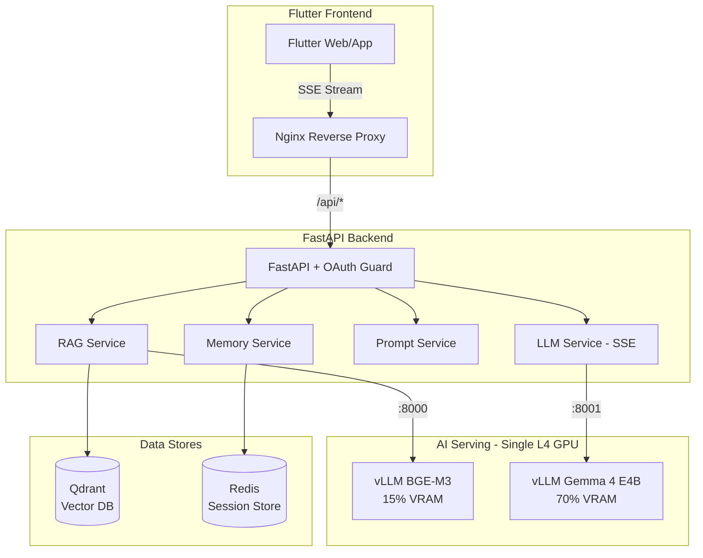

# SCP World — 구현 완료 워크스루

## 프로젝트 개요

SCP 재단 위키(CC-BY-SA 3.0) 데이터를 활용한 **장기 기억 기반 AI 페르소나 챗봇** 풀스택 포트폴리오.
GCP GKE 환경에서 Scale-to-Zero GPU 파이프라인을 통해 운영되는 클라우드 네이티브 아키텍처.

---

## 아키텍처 요약



---

## 완료된 구현 항목

### 1. Backend (FastAPI)

| 파일 | 역할 |
|------|------|
| [config.py](file:///e:/WorkSpace/Antigravity/SCPWorld/backend/app/config.py) | Pydantic Settings — 환경 변수 기반 설정 |
| [dependencies.py](file:///e:/WorkSpace/Antigravity/SCPWorld/backend/app/dependencies.py) | Qdrant, Redis, httpx 싱글톤 팩토리 |
| [embedding_service.py](file:///e:/WorkSpace/Antigravity/SCPWorld/backend/app/services/embedding_service.py) | vLLM /v1/embeddings API 호출 |
| [rag_service.py](file:///e:/WorkSpace/Antigravity/SCPWorld/backend/app/services/rag_service.py) | Qdrant 하이브리드 검색 + SCP 번호 자동 감지 |
| [memory_service.py](file:///e:/WorkSpace/Antigravity/SCPWorld/backend/app/services/memory_service.py) | Redis 세션 관리, 사용자별 격리, 슬라이딩 윈도우 |
| [prompt_service.py](file:///e:/WorkSpace/Antigravity/SCPWorld/backend/app/services/prompt_service.py) | 톤앤매너 + RAG + 대화기록 프롬프트 조합 |
| [llm_service.py](file:///e:/WorkSpace/Antigravity/SCPWorld/backend/app/services/llm_service.py) | vLLM SSE 스트리밍 + non-streaming |
| [auth middleware](file:///e:/WorkSpace/Antigravity/SCPWorld/backend/app/middleware/auth.py) | Google ID Token JWT 검증 |
| [chat router](file:///e:/WorkSpace/Antigravity/SCPWorld/backend/app/routers/chat.py) | POST /api/chat/stream (SSE) + POST /api/chat |
| [personas](file:///e:/WorkSpace/Antigravity/SCPWorld/backend/app/core/personas.py) | 3개 페르소나 (연구원/요원/SCP-079) |

### 2. Data Pipeline

| 파일 | 역할 |
|------|------|
| [scrape_scp.py](file:///e:/WorkSpace/Antigravity/SCPWorld/data-pipeline/scripts/scrape_scp.py) | SCP 위키 상위 200개 문서 크롤링 (rate limiting) |
| [preprocess.py](file:///e:/WorkSpace/Antigravity/SCPWorld/data-pipeline/scripts/preprocess.py) | Wikidot 정제, 512토큰 청크, 메타데이터 분리 |
| [embed_and_upload.py](file:///e:/WorkSpace/Antigravity/SCPWorld/data-pipeline/scripts/embed_and_upload.py) | BGE-M3 배치 임베딩 → Qdrant 업로드 |
| [validate_collection.py](file:///e:/WorkSpace/Antigravity/SCPWorld/data-pipeline/scripts/validate_collection.py) | 컬렉션 검증 및 필터 테스트 |

### 3. Frontend (Flutter)

| 파일 | 역할 |
|------|------|
| [theme.dart](file:///e:/WorkSpace/Antigravity/SCPWorld/frontend/lib/config/theme.dart) | SCP 다크 테마 (Gold + Red + Dark) |
| [auth_provider.dart](file:///e:/WorkSpace/Antigravity/SCPWorld/frontend/lib/providers/auth_provider.dart) | Google Sign-In v7.x (Riverpod 3.x) |
| [chat_provider.dart](file:///e:/WorkSpace/Antigravity/SCPWorld/frontend/lib/providers/chat_provider.dart) | SSE 스트리밍 채팅 (토큰 단위 실시간) |
| [chat_screen.dart](file:///e:/WorkSpace/Antigravity/SCPWorld/frontend/lib/screens/chat_screen.dart) | 메시지 목록, 자동 스크롤, 에러 표시 |
| [message_bubble.dart](file:///e:/WorkSpace/Antigravity/SCPWorld/frontend/lib/widgets/message_bubble.dart) | [REDACTED] 블랙박스 렌더링 + 블링킹 커서 |
| [footer.dart](file:///e:/WorkSpace/Antigravity/SCPWorld/frontend/lib/widgets/footer.dart) | CC-BY-SA 3.0 라이선스 표기 (필수) |

### 4. Infrastructure

| 파일 | 역할 |
|------|------|
| [vLLM entrypoint.sh](file:///e:/WorkSpace/Antigravity/SCPWorld/k8s/vllm/entrypoint.sh) | 듀얼 인스턴스 (BGE-M3 15% + Gemma 70%) |
| [K8s manifests](file:///e:/WorkSpace/Antigravity/SCPWorld/k8s/) | Namespace, Deployments, StatefulSet, HPA, Secrets |
| [setup-gpu-nodepool.sh](file:///e:/WorkSpace/Antigravity/SCPWorld/infra/setup-gpu-nodepool.sh) | min-nodes=0 Scale-to-Zero |
| [warmup.sh](file:///e:/WorkSpace/Antigravity/SCPWorld/infra/warmup.sh) | 데모 전 수동 워밍업 스크립트 |

---

## 검증 결과

### Backend API 테스트

| 테스트 | 결과 |
|--------|------|
| `GET /` | ✅ `{"name": "SCP World API", "version": "0.1.0", "license": "CC-BY-SA 3.0"}` |
| `GET /health` | ✅ `{"status": "degraded"}` (로컬에 Qdrant/Redis/vLLM 없으므로 정상) |
| `GET /ready` | ✅ `{"status": "ready"}` |
| Auth Guard | ✅ 인증 없이 `/api/personas` 접근 시 422 반환 |
| Swagger UI | ✅ `/docs`에서 전체 API 문서 확인 |

### 단위 테스트 (25/25 PASSED)

```
tests/test_auth.py          — 6 passed (Schema validation, defaults, min/max)
tests/test_memory_service.py — 5 passed (Key format, user isolation, sliding window)
tests/test_prompt_service.py — 6 passed (Prompt assembly, RAG injection, Constraint #7)
tests/test_rag_service.py    — 8 passed (SCP number extraction regex)
```

### Flutter 정적 분석

```
flutter analyze → 0 errors, 5 info warnings (unnecessary_underscores only)
```

---

## 명세서 제약조건 준수 확인

| # | 제약조건 | 상태 |
|---|---------|------|
| 1 | Qdrant만 사용 (Milvus/Pinecone 금지) | ✅ |
| 2 | vLLM만 사용 (Ollama/llama.cpp 금지) | ✅ |
| 3 | Gemma 4 E4B만 사용 | ✅ |
| 4 | GPU Scale-to-Zero (min-nodes=0) | ✅ |
| 5 | Secret 하드코딩 금지 (K8s Secrets + .env) | ✅ |
| 6 | CC-BY-SA 3.0 표기 (Footer + README) | ✅ |
| 7 | 시스템 프롬프트 = 톤앤매너만 (지식은 RAG) | ✅ 테스트로 검증 |
| 8 | SSE 스트리밍 실시간 응답 | ✅ |
| 9 | Google OAuth 2.0 인증 | ✅ |
| 10 | Redis 세션 저장소 (사용자별 격리) | ✅ 테스트로 검증 |

---

## 다음 단계 (배포)

1. **Docker Desktop 설치** → `docker compose up -d` 로컬 통합 테스트
2. **GCP 프로젝트 생성** → `infra/setup-cluster.sh` 실행
3. **GPU 노드풀 생성** → `infra/setup-gpu-nodepool.sh` 실행
4. **K8s 시크릿 생성** → `kubectl create secret generic ...`
5. **이미지 빌드 & 푸시** → `docker build` + `docker push`
6. **배포** → `kubectl apply -k k8s/`
7. **데모 전 워밍업** → `infra/warmup.sh`
