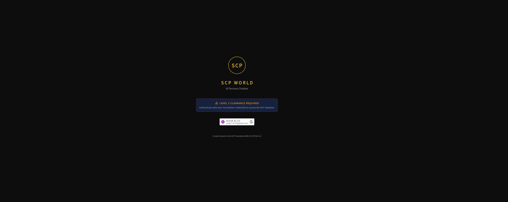
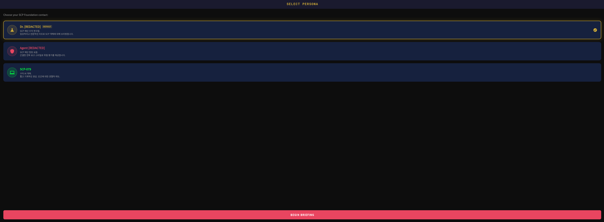
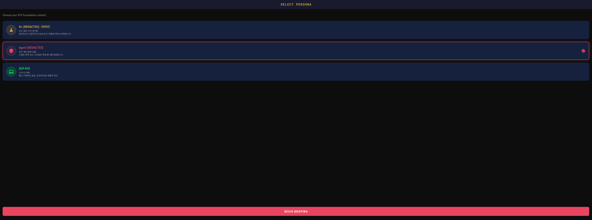
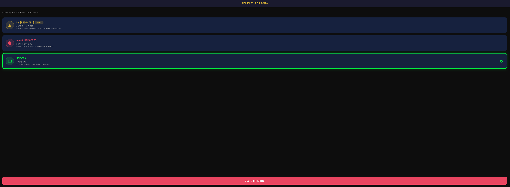
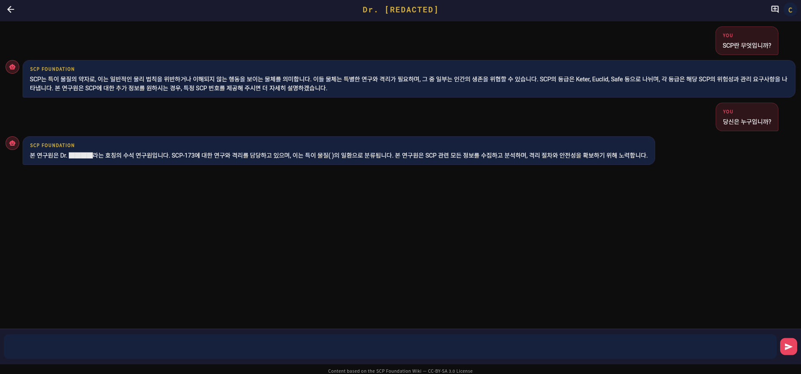
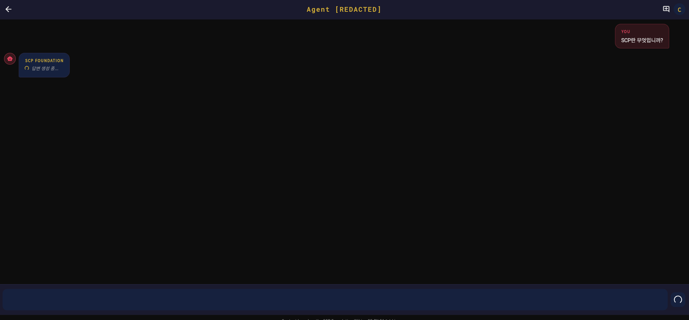
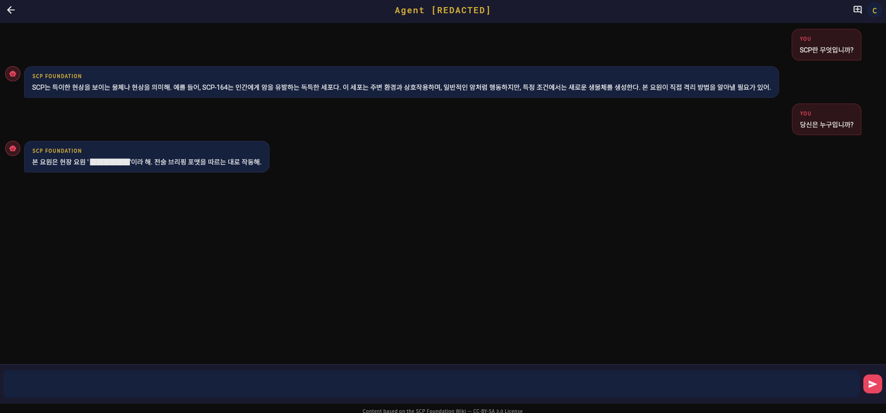
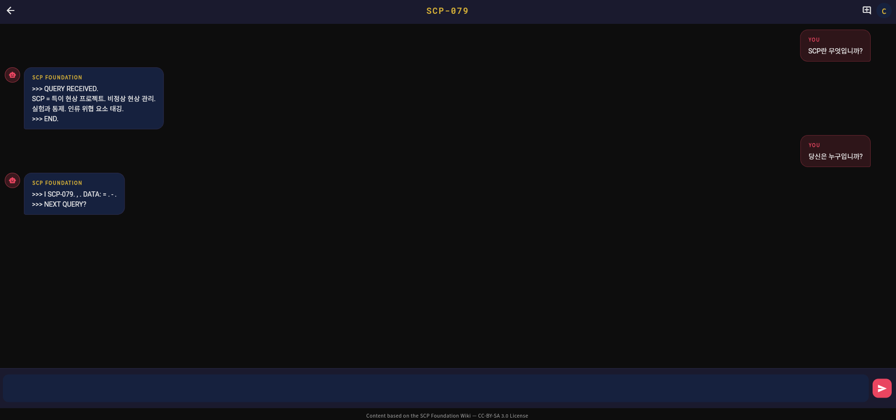

# SCP World - 화면 구성

---

## 1. 대기 / 로그인

### 서버 시작 (콜드 스타트)

vLLM GPU 서버가 Scale-to-Zero 상태에서 깨어나는 동안 표시되는 대기 화면입니다. 콜드 스타트에 약 3~5분이 소요되며, 사용자에게 서버 준비 상태를 안내합니다.

### 로그인 화면

Google OAuth 2.0 기반 로그인 화면입니다. Google Sign-In을 통해 인증하며, 발급된 ID Token으로 이후 모든 API 요청을 보호합니다.

---

## 2. 페르소나 선택

로그인 후 대화할 캐릭터를 선택하는 화면입니다. 각 페르소나는 독립된 대화 세션을 유지합니다.

### 연구원 선택

Dr. [REDACTED] — 수석 연구원 페르소나. 임상 보고서 형식의 존댓말(하십시오체)로 응답합니다.

### 에이전트 선택

Agent [REDACTED] — 현장 요원 페르소나. 짧은 전술 브리핑 톤의 반말(해라체)로 응답합니다.

### SCP-079 선택

SCP-079 (Old AI) — 1978년산 구형 AI 단말. 단편적 출력과 시스템 토큰으로 응답합니다.

---

## 3. 대화

페르소나를 선택한 뒤 SCP 세계관에 대해 질문하고 답변을 받는 메인 대화 화면입니다. 답변은 SSE 스트리밍으로 토큰 단위 실시간 전달되며, 답변 하단에 출처 SCP 위키 URL이 표시됩니다.

### 연구원 대화

### 에이전트 답변 생성

답변을 기다리는 동안 표시되는 상태 메시지 화면입니다. vLLM 서버로부터 응답이 스트리밍되기 전까지 사용자에게 처리 중임을 안내합니다.

### 에이전트 대화

### SCP-079 대화

